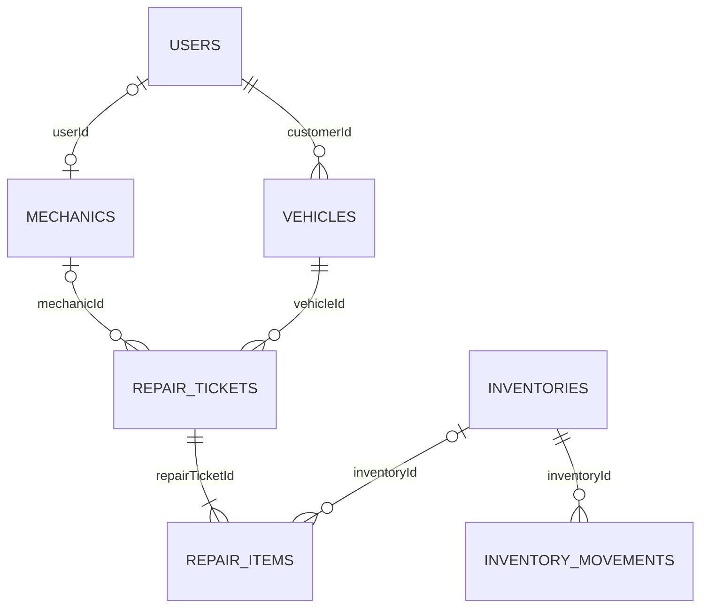

# Dữ liệu và luồng xử lý

## Quan hệ

`customerName`, `mechanicName`, `partName` và giá trên phiếu được giữ để hiển thị/lưu thông tin nghiệp vụ. Chúng không được dùng để xác định quyền truy cập. `customerId` có thể null với khách vãng lai; `userId` có thể null với hồ sơ thợ chưa có tài khoản; `inventoryId` có thể null với công việc không dùng vật tư hoặc hạng mục cũ chưa được liên kết.

Tiền dùng PostgreSQL `NUMERIC(14,2)` và Python Decimal. API trả số cho frontend hiển thị bằng định dạng VND. Backend không tin `totalPrice`, `totalAmount`, giá vật tư hoặc tên thợ do trình duyệt tự gửi.

Các cột thời gian cũ vẫn là timestamp không kèm timezone, quy ước lưu UTC. Kết nối ứng dụng đặt timezone UTC và API trả ISO có offset; báo cáo tháng quy đổi khoảng ngày Việt Nam sang UTC trước khi truy vấn.

## Migration 001

- Thêm FK tài khoản–xe, tài khoản–thợ, thợ–phiếu, vật tư–hạng mục; không đoán danh tính từ tên.
- Tạo bảng lịch sử kho và yêu cầu đặt lịch.
- Mở rộng độ chính xác trường tiền và thêm check constraint cho giá, số lượng, trạng thái.
- Tính lại tổng phiếu chưa thanh toán từ hạng mục hiện có; giữ nguyên tổng phiếu đã thu.
- Chuyển danh mục hiệu xe/tiền công trước đây viết trong HTML vào database. Không ghi đè các mục đã có.
- Tách chuỗi kiểu `Toyota Vios` thành hiệu xe `Toyota`, dòng xe `Vios` khi khớp danh mục đã biết và chưa có carModel.
- Không trừ kho hồi tố cho phiếu cũ: dữ liệu cũ không chứng minh vật tư nào đã thực xuất. Nhật ký bắt đầu từ các thao tác sau nâng cấp.

Phiếu cũ có giá vật tư nhưng chưa có inventoryId giữ nguyên hạng mục và giá. Có thể liên kết thợ, tiếp tục tiến độ, thanh toán; không thay toàn bộ hạng mục qua form mới để tránh mất thông tin vật tư cũ.

Không có downgrade tự động vì việc bỏ cột sẽ mất liên kết mới. Muốn quay lại, khôi phục backup vào database riêng trong pgAdmin, kiểm tra rồi trỏ `DATABASE_URL` và code tương ứng về bản cũ. Không khôi phục đè database đang dùng khi chưa kiểm tra.

## Giao dịch

Tạo phiếu khóa xe, kiểm tra phiếu chưa thanh toán, khóa thợ và các mã vật tư theo thứ tự ID, kiểm tra tổng số lượng cho cả các dòng trùng mã, rồi ghi phiếu/hạng mục/tồn kho/nhật ký trong một transaction. Khi có lỗi toàn bộ transaction được rollback.

Sửa hoặc xóa phiếu chờ xử lý khóa theo cùng thứ tự, hoàn số lượng đã giữ và xuất lượng mới. Hạng mục đã bắt đầu không thể bị thay thế. Cập nhật checkbox chỉ áp dụng khi phiếu đang làm. Thợ chỉ thấy và sửa phiếu có mechanicId trỏ tới hồ sơ liên kết userId của mình.

JWT được đối chiếu với tài khoản hiện có trong database mỗi request; xóa tài khoản làm token cũ mất hiệu lực. Khóa ngoại ngăn xóa tài khoản đang được liên kết.

## Kiểm tra sau nâng cấp

1. Kiểm tra danh sách xe/phiếu cũ vẫn đủ.
2. Liên kết tài khoản khách hàng và thợ theo email trong admin.
3. Tạo phiếu thử trên database thử nghiệm, kiểm tra tồn kho và thành tiền.
4. Đăng nhập thợ, bắt đầu, hoàn thành từng mục; đăng nhập khách để xem tiến độ.
5. Admin hoàn thành/thu tiền/giao xe; kiểm tra báo cáo theo tháng thu tiền.
6. Kiểm tra yêu cầu đặt lịch từ trang chủ xuất hiện trong admin.

UI đang hỗ trợ ba vai trò admin, mechanic, customer. Chưa có sổ thanh toán từng phần/hoàn tiền hoặc quản lý nhiều chi nhánh. Mỗi phiếu chỉ có một lần thu đủ tiền.
